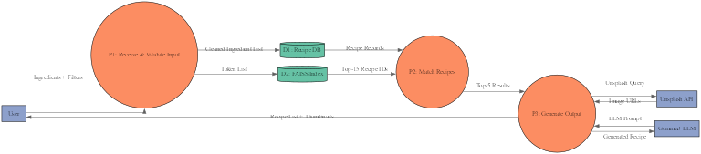
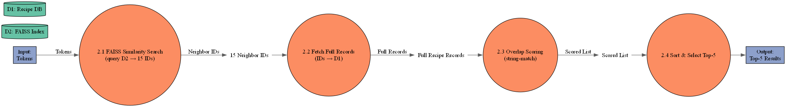
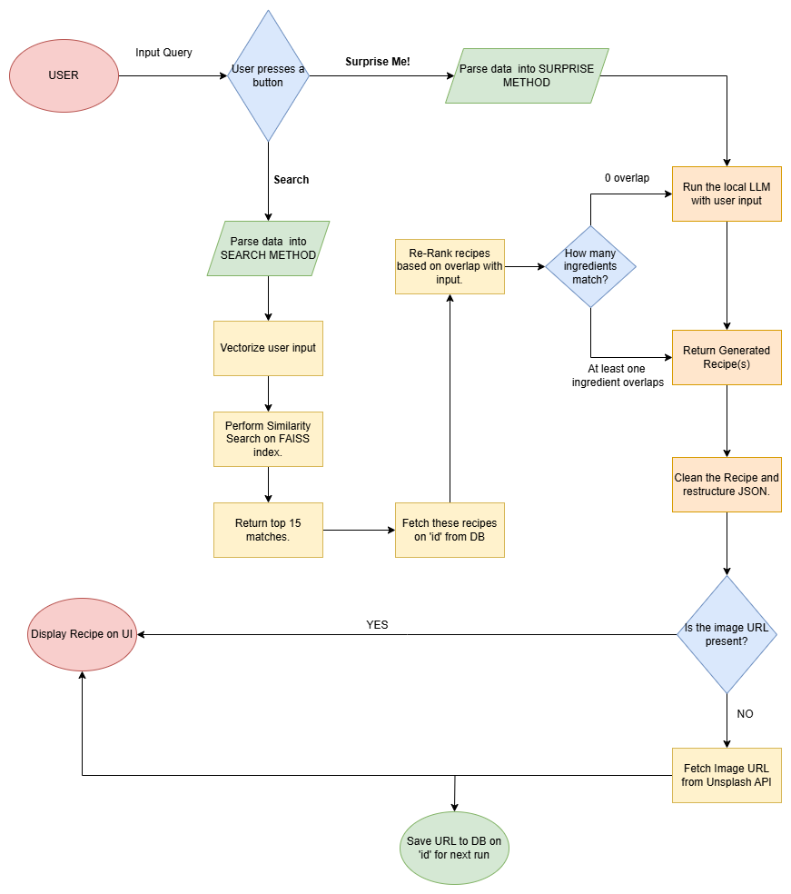

# Recipe Generator

A brief description of what this project does and who it's for

# RecipeMatch

  
  

**Find recipes from what’s in your pantry—exact‐match if available, nearest‐neighbour otherwise, with a generative “vibe” fallback.**

---

## 🚀 Table of Contents

- [Features](#features)  
- [Architecture](#architecture)  
- [Getting Started](#getting-started)  
  - [Prerequisites](#prerequisites)  
  - [Installation](#installation)  
  - [Configuration](#configuration)  
  - [Database Setup](#database-setup)  
- [Usage](#usage)  
- [Project Roadmap](#project-roadmap)  
- [Contributing](#contributing)  
- [License](#license)  

---

## 🏆 Features

- **Ingredient‐based Matching**  
  - Exact‐match or nearest‐neighbour via FAISS over tokenized ingredient lists  
  - Re‐ranks top 15 candidates by string-overlap score → returns top 5  
- **Custom “Vibe” Generation**  
  - Local Gemma3 1B LLM generates creative recipes when no match or on “vibe” requests  
- **Dynamic Thumbnails**  
  - Unsplash API integration for high-quality recipe images  
- **Dietary & Cuisine Filters - switched to next scope**  
  - Vegan, Gluten-Free, Keto, and more  
  - Italian, Indian, Mexican, etc.  
- **Interactive UI**  
  - Built with Streamlit for rapid prototyping and live demos  
- **High Performance**  
  - Query latency < 200 ms on 250K+ recipes (FAISS + caching)  

---

## 🏗 Architecture
Level 1 DFD Diagram

Level 2 DFD Diagram - Ingredient Matching

Architecture Flow Diagram -

Additionally refer to the architecture document.
